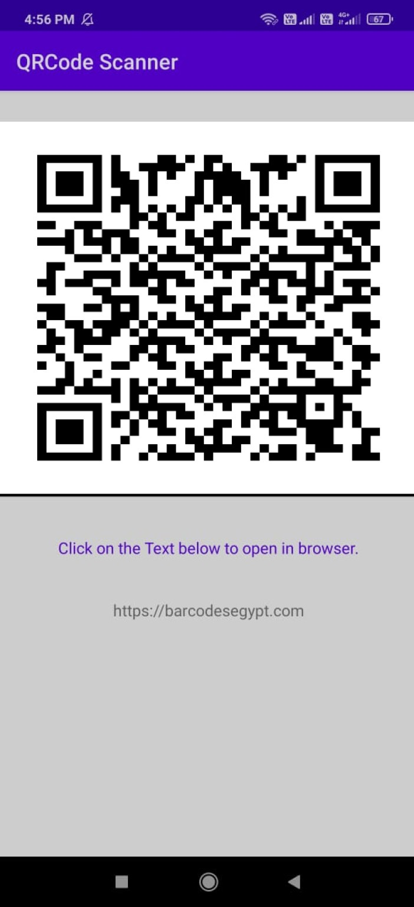

# QRCode-Scanner

## About the Project 

`QR Code Scanner` is an `android application` that scans a **_QR code_** that uses a `web-based application` that **_accesses your camera and scans the QR code_** and `returns the results`.

## How does the app works?

`Step 1:`  Place the phone camera over the QR Code to be scanned.

`Step 2:`  When the QR Code is detected application notifies with phone vibrartion.

`Step 3:`  The QR code result will appear in text below.
 
`Step 4:`  Click on the returned value (link) to view in browser.

## Screenshots of the application

<table>
        <tr> 
         <td>1. Main Page    </td>
         <td>2. Scanning Code   </td>
         <td>3. Open in Browser   </td>
        </tr>
 </table>
 
## Technology

- `JAVA` for back-end
- `XML` for front-end

## Tools

- `Android Studio`
- `Git`
- `GitHub`

## Setting up project

1. Fork this project by clicking the Fork button on top right corner of this page.

2. Clone the repository by running following command in git:

   `$ git clone https://github.com/[YOUR-USERNAME]/QRCode-Scanner.git`
